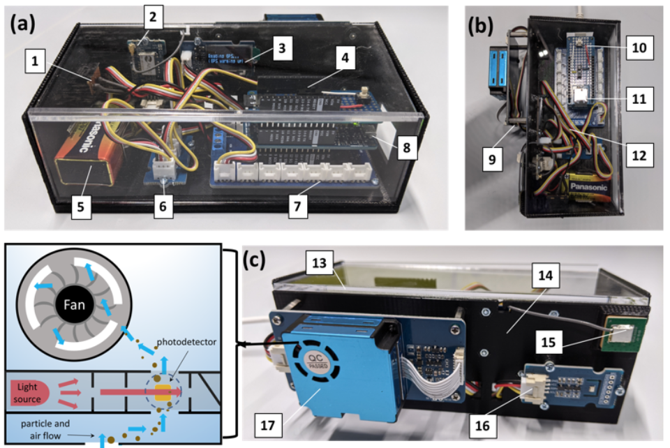
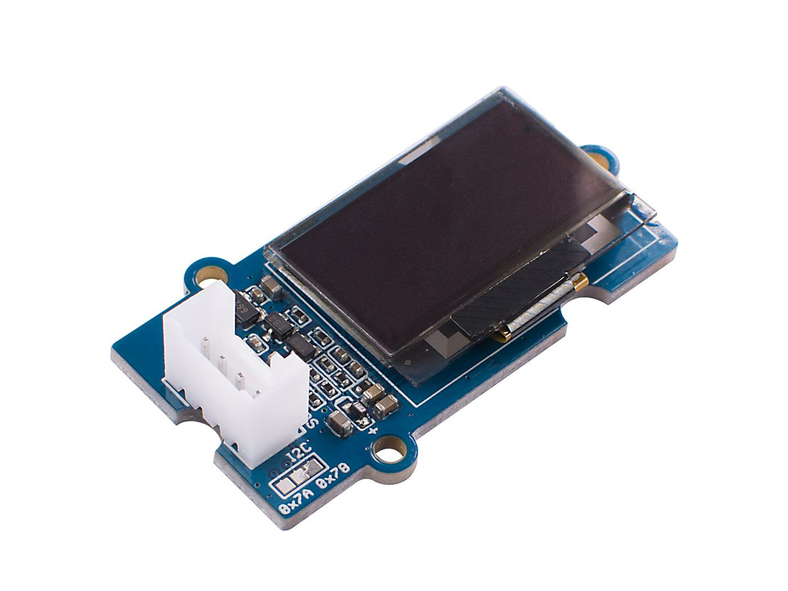

<p align="center">
  
</p>

# HazeL

HazeL is a low-cost, easy to manufacture particulate matter (PM) sensor created for the Harvard University SEAS course ESE6, Introduction to Environmental Science and Engineering. It was designed in response to the need for remote lab activites during the COVID-19 pandemic. Instead of students needing to share a limited number of expensive sensors, every student was able to collect their own data with their own personal sensor. 

 

All modules and sensors in HazeL use the [Grove connector system](https://www.seeedstudio.com/category/Grove-c-1003.html).

We have open sourced all of our design files in this repository, including the 3D printing files for the [enclosure](enclosure). If you are interested in deploying your own version of HazeL and have any questions beyond those answered by looking through this repository, feel free to reach out to Ben Brown at brown@g.harvard.edu. 

## Device operation

On start-up, HazeL initializes all sensors and modules, then begins collecting data. Data are stored in a file called `data.txt` (HazeL will create this file on the SD card if it doesn't already exist, otherwise it will just begin appending data). Particulate matter data are collected from the dust sensor every 2.5 seconds and saved to the SD card (see below for more information on the exact data returned). As data are saved to the SD card, they are also sent over USB, providing the option for capturing or displaying a live data stream (see [scripts](scripts) for more info). PM1.0, PM2.5, and PM10.0 concentrations are displayed on the OLED display every time data are saved.

Every 10 seconds, a line of metadata (beginning with a `#`) is stored, including an ISO8601 UTC timestamp, latitude, longitude, altitude, temperature in degrees C, and pressure in pascals. To save energy, the GPS is put to sleep in between GPS reads.

Every line (data and metadata) begins with the number of ms elapsed since the HazeL was turned on.

**Note:** Depending on the strength of GPS signals, the first GPS read may take a few minutes, during which time the OLED will read:
```
Reading GPS...
(GPS warming up)
```
HazeL will wait up to 10 minutes for a successful GPS read before it starts collecting data. If the initial GPS read takes longer than 10 minutes, HazeL will begin collecting data, and metadata lines will read `GPS read failed` before the temperature and pressure. 

## The Arduino (and accessories)

The [Arduino MKR1000](https://store.arduino.cc/usa/arduino-mkr1000-with-headers-mounted) serves as the brains of HazeL, mounted on the [MKR Connector Carrier](https://store.arduino.cc/usa/arduino-mkr-connector-carrier). In addition to providing plenty of Grove connectors, the MKR Connector Carrier also has an on-board buck converter to step down the incoming 9V from a 9V battery to 5V for the Arduino, allowing for battery operation. The [MKR SD Proto Shield](https://store.arduino.cc/usa/mkr-sd-proto-shield) is mounted onto the MKR1000, which provides a microSD card slot, as well as a protoboard onto which a button and switch can be soldered (used for initating data uploads over USB, more details in the [scripts](scripts) folder).

The Arduino code can be found in [HazeL.ino](src/HazeL.ino). While only tested on the MKR1000, it should be compatible with most Arduinos (**note:** this is not true of the code on the thingspeak branch, which takes advantage of the WiFi capabilities of the MKR1000 to create an IoT enabled version of HazeL). Feel free to submit an issue if you encounter issues on other platforms. 

This repository is structured as a [PlatformIO](https://platformio.org/) project, if you'd like to use it within the Arduino IDE instead, move the contents of the [src](src) and [include](include) folders into a folder entitled `HazeL`, and open `HazeL.ino` in the Arduino IDE. 

## Grove modules

### [HM3301 dust sensor](https://www.seeedstudio.com/Grove-Laser-PM2-5-Sensor-HM3301.html)


The HM3301 is the dust sensor used in HazeL. It returns the following data, all of which are saved on each data line in `data.txt` in the order shown below:

|Datum|Units|
|:---:|:---:|
|PM1.0 (standard)|&#956;g/m<sup>3</sup>|
|PM2.5 (standard)|&#956;g/m<sup>3</sup>|
|PM10.0 (standard)|&#956;g/m<sup>3</sup>|
|PM1.0 (atmospheric)|&#956;g/m<sup>3</sup>|
|PM2.5 (atmospheric)|&#956;g/m<sup>3</sup>|
|PM10.0 (atmospheric)|&#956;g/m<sup>3</sup>|
|>0.3 &#956;m|Particle count/0.1L|
|>0.5 &#956;m|Particle count/0.1L|
|>1.0 &#956;m|Particle count/0.1L|
|>2.5 &#956;m|Particle count/0.1L|
|>5.0 &#956;m|Particle count/0.1L|
|>10.0 &#956;m|Particle count/0.1L|

The HM3301 communicates with the Arduino over I2C, using a custom library written for HazeL (see [HM3301.cpp](src/HM3301.cpp) and [HM3301.h](include/HM3301.h)).

It should be mounted to the outside of the enclosure, with sufficient clearance to allow for unobstructed airflow into the inlet.

### [BMP280 temperature and pressure sensor](https://www.seeedstudio.com/Grove-Barometer-Sensor-BMP280.html)


The BMP280 is a low-cost temperature sensor and barometer that communicates over I2C, using a slightly modified version of Seeed's [library](https://github.com/Seeed-Studio/Grove_BMP280) that can be found [here](https://github.com/brownby/Grove_BMP280). 

It should be mounted on the outside of the enclosure as well, close to the HM3301.

### [Air530 GPS module](https://www.seeedstudio.com/Grove-GPS-Air530-p-4584.html)


The Air530 is low-cost GPS module that comes with a small antenna. It communicates over UART, currently just using functions inside of [HazeL.ino](src/HazeL.ino), but I will likely break this out into a separate library in the future. The GPS readings are decoded using the [TinyGPS++ library](http://arduiniana.org/libraries/tinygpsplus/) by Mikal Hart.

### [SSD1315 OLED display](https://www.seeedstudio.com/Grove-OLED-Display-0-96-SSD1315-p-4294.html)



The SSD1315 is a super low-cost 0.96" monochrome OLED display. The display is used to display data to the user, as well as various error messages if HazeL encounters issues on start-up. The OLED communicates over I2C using the [u8g2 library](https://github.com/olikraus/u8g2) by olikraus. 

### [I2C hub](https://www.seeedstudio.com/Grove-I2C-Hub.html)


The Grove I2C hub was used to connect the I2C devices (dust sensor, T+P sensor, and OLED display) to the MKR1000's I2C bus.
