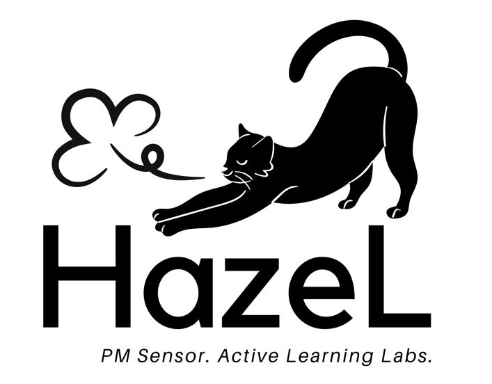
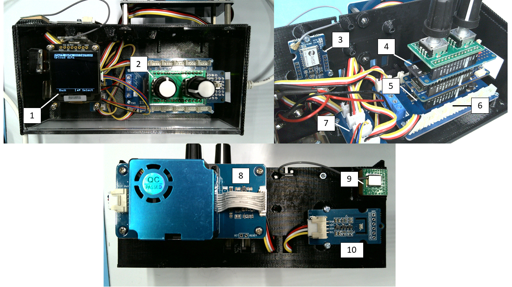
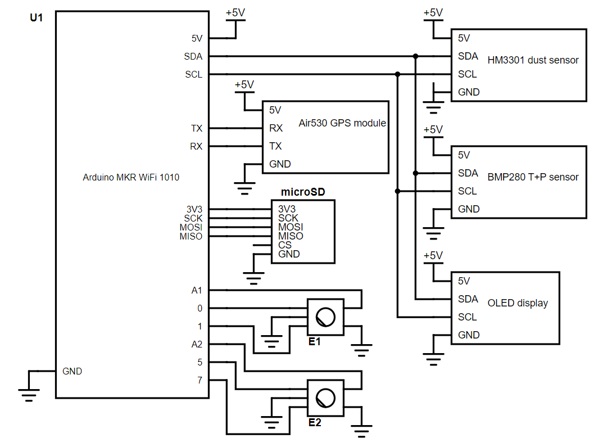
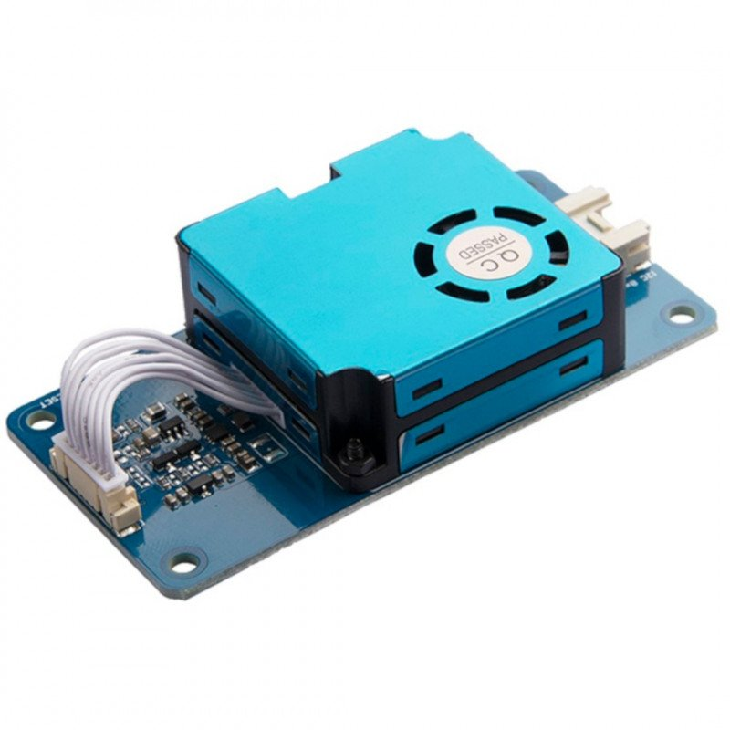
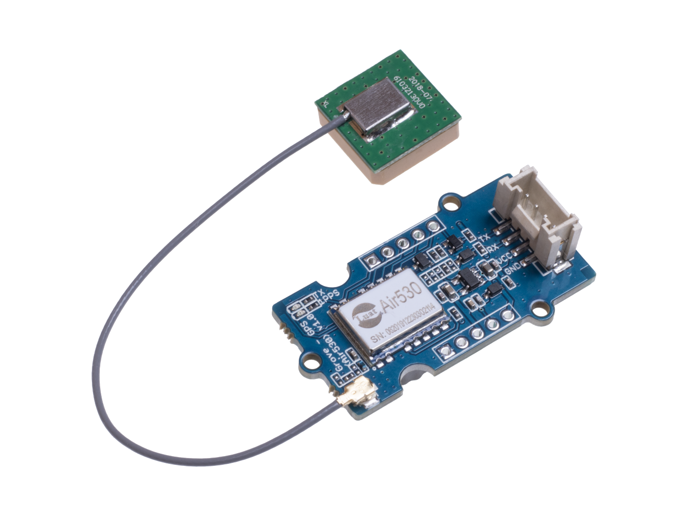
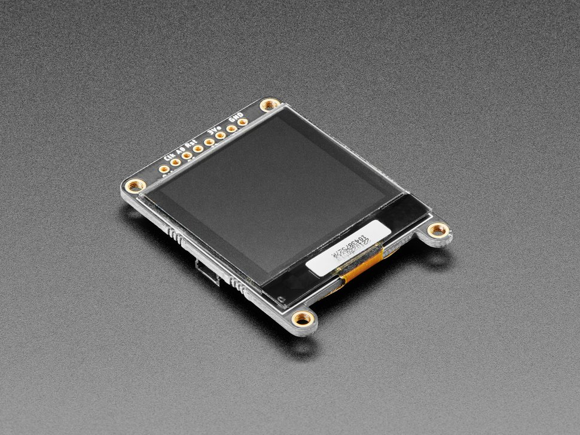
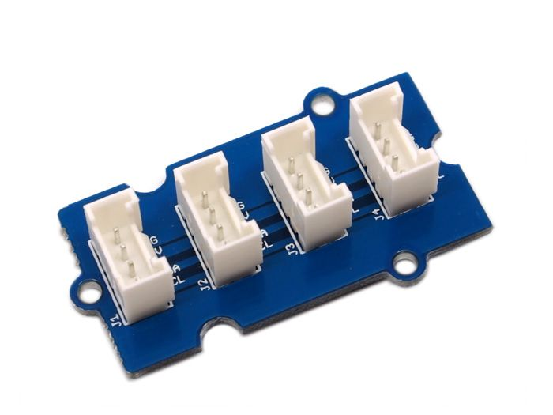

<p align="center">
  
</p>

# HazeL

HazeL is a low-cost, easy to manufacture particulate matter (PM) sensor created for the Harvard University SEAS course ESE6, Introduction to Environmental Science and Engineering. It was designed in response to the need for remote lab activites during the COVID-19 pandemic, but will continue to be used for the foreseeable future. Instead of students needing to share a limited number of expensive sensors, every student is able to collect their own data with their own personal sensor. 

<p align="center">
 
</p>
The components that make up HazeL are, as numbered in the above image:

1. OLED display
2. Rotary encoders mounted on custom PCB
3. GPS module
4. MKR SD shield w/ microSD card inserted
5. Arduino MKR WiFi 1010
6. MKR connector carrier
7. Grove I2C hub
8. Dust sensor
9. GPS antenna
10. Temperature and pressure sensor

All modules and sensors in HazeL use the [Grove connector system](https://www.seeedstudio.com/category/Grove-c-1003.html). You can find links to all of the components of HazeL in the next few sections.

A simplified electrical schematic of HazeL is shown below. **Note:** the level-shifting circuitry present on the MKR connector carrier is abstracted away in this schematic, but remember that Grove devices are 5V logic, while the MKR-series Arduinos are 3.3V logic devices. 

<p align="center">

</p>

We have open sourced all of our design files in this repository, including the 3D printing files for the [enclosure](enclosure). If you are interested in deploying your own version of HazeL and have any questions beyond those answered by looking through this repository, feel free to reach out to Ben Brown at brown@g.harvard.edu. 

# Device operation

On start-up, HazeL initializes all sensors and modules, then opens the home menu with two options:
```
Start data collection
Upload data
```

For all menus, you use the right knob to scroll up and down, and press the knob to select. The left knob will be used to scroll left and right (when relevant), and can be pressed to go back a menu. 

## Data collection

When you select `Start data collection`, another menu will appear asking you what method you would like to use to timestamp your data:
```
Timestamp method?
_________________
Auto (GPS)
Manual
```

**`Auto (GPS)`**: HazeL will use the GPS module to timestamp data (as well as provide latitude, longitude, and altitude). The first GPS read can take a few minutes - if it takes longer than ten minutes, the read will time out and a message will appear suggesting you enter a timestamp manually. 

**`Manual`**: You will enter a date and time manually using the two knobs (**Note**: the time should be in UTC), at which point HazeL will sync the microcontroller's real-time counter (RTC) peripheral to the time you entered. During data collection, further timestamps will be pulled from the RTC. 

Once an initial timestamp is collected (whether by the GPS or entered by the user), HazeL creates two timestamped files on the SD card that will be used to store data and metadata. The naming convention for the files is:
```
YYMMDD_HHMMSS_data.txt
YYMMDD_HHMMSS_meta.txt
```

Every 2.5 seconds, particulate matter data are collected from the dust sensor and saved in the `data` file. For the list of data that are collected and saved, see the [HM3301 dust sensor section](#hm3301-dust-sensor) below. Each line of the `data` file also starts with the number of milliseconds elapsed since data collection began as well as an ISO8601 UTC timestamp.

Every 10 seconds, a line of metadata is stored in the `meta` file. One line of metadata includes: 
```
ms timer, ISO8601 UTC timestamp, latitude, longitude, altitude, temperature in degrees C, pressure in pascals
```
If the RTC is being used for timestamps (i.e. if `Manual` was selected), the `latitude`, `longitude`, and `altitude` entries will be empty. The RTC may also be used if you selected `Auto (GPS)`, but only in cases where a GPS read takes longer than 5 seconds. The `ms timer` value is the number of milliseconds elapsed since data collection began. This value, as well as the timestamp, will match on a line where both data and metadata are collected, allowing for synchronization of the two files in post-processing. 

As data are being saved to the SD card, they are also being sent over USB to allow for capturing a livestream of data. Livestreamed metadata lines begin with a `#` to differentiate them from data. 

The OLED display will also show data as it is collected, specifically the PM2.5 concentration in &mu;g/m<sup>3</sup>. The current date and time (in UTC) are shown at the bottom of the display, as well as the source of the timestamp (either `RTC` or `GPS`):

```
PM2.5:

5
ug/m3

1/13/2022 18:24 (GPS)
```

When you are done collecting data, you can press the back button to return to the previous menu, or simply turn off the device.

**Note on GPS:** 
As mentioned above, depending on the strength of GPS signals, the first GPS read may take a few minutes, during which time the OLED will read:
```
Reading GPS...

(First GPS read
may take a
few minutes)
```
HazeL will wait up to 10 minutes for a successful first GPS read before it starts collecting data. If the initial GPS read takes longer than 10 minutes, it is recommended to enter a timestamp manually instead. 

The RTC is synced to the GPS on every successful GPS read. When a GPS read is unsuccessful (i.e. takes longer than 5 seconds), HazeL will automatically pull the timestamp from the RTC instead. This should allow the RTC to fill in gaps in GPS reads caused by spotty GPS signals. As noted above, any metadata line that uses the RTC will have blank latitude, longitude, and altitude entries.

## Uploading data

When you select `Upload data`, a new menu will appear with a list of all of the data and metadata files stored on the SD card in reverse chronological order. For example, if you collected data three times on `1/13/22`, once at `9:24:29`, once at `13:40:12`, and once at `18:08:57`, the screen would look like this:

```
Select a file
___________________
221301_180857_meta
221301_180857_data
221301_134012_meta
221301_134012_data
221301_092429_meta
221301_092429_data
```

Scroll to the file you would like to upload with the right knob, and select it by pressing the right knob. Once you select a file, the data from the file is sent over USB, and the screen will display:

```
Uploading
<file_name>
via serial port
```

In order to save data to your computer, you must use one of the data download scripts in the [scripts](scripts) folder of this repository. You can find more info on how to use the scripts in the README in that folder. 

# HazeL components

## Arduino MKR WiFi 1010

The [Arduino MKR WiFi 1010](https://store-usa.arduino.cc/products/arduino-mkr-wifi-1010) serves as the brains of HazeL, mounted on the [MKR Connector Carrier](https://store.arduino.cc/usa/arduino-mkr-connector-carrier). The [MKR SD Proto Shield](https://store.arduino.cc/usa/mkr-sd-proto-shield) is mounted onto the MKR WiFi 1010, which provides a microSD card slot.

The Arduino code can be found in [HazeL.ino](src/HazeL.ino). While only tested on the MKR1000 and MKR WiFi 1010, it should be compatible with most SAMD21-based Arduinos (**note:** this is not true of the code on the thingspeak branch, which takes advantage of the WiFi capabilities of the MKR1000 and MKR WiFi 1010 to create an IoT enabled version of HazeL). Feel free to submit an issue if you encounter issues on other platforms. 

This repository is structured as a [PlatformIO](https://platformio.org/) project, if you'd like to use it within the Arduino IDE instead, move the contents of the [src](src) and [include](include) folders into a folder entitled `HazeL`, and open `HazeL.ino` in the Arduino IDE. 

## Other modules

### [HM3301 dust sensor](https://www.seeedstudio.com/Grove-Laser-PM2-5-Sensor-HM3301.html)



The HM3301 is the dust sensor used in HazeL. It returns the following data, all of which are saved on each data line in `data.txt` in the order shown below:

|Datum|Units|
|:---:|:---:|
|PM1.0 (standard)&#8224;|&#956;g/m<sup>3</sup>|
|PM2.5 (standard)&#8224;|&#956;g/m<sup>3</sup>|
|PM10.0 (standard)&#8224;|&#956;g/m<sup>3</sup>|
|PM1.0 (atmospheric)|&#956;g/m<sup>3</sup>|
|PM2.5 (atmospheric)|&#956;g/m<sup>3</sup>|
|PM10.0 (atmospheric)|&#956;g/m<sup>3</sup>|
|>0.3 &#956;m*|Particle count/0.1L|
|>0.5 &#956;m*|Particle count/0.1L|
|>1.0 &#956;m*|Particle count/0.1L|
|>2.5 &#956;m*|Particle count/0.1L|
|>5.0 &#956;m*|Particle count/0.1L|nmjjjjjjjjjjjjjjjjjjjjjjjjj
|>10.0 &#956;m*|Particle count/0.1L|

The HM3301 communicates with the Arduino over I2C, using a custom library written for HazeL (see [HM3301.cpp](src/HM3301.cpp) and [HM3301.h](include/HM3301.h)).

It should be mounted to the outside of the enclosure, with sufficient clearance to allow for unobstructed airflow into the inlet.

&#8224;These data are not saved to the SD card in the current version of HazeL.

*These data are reported as all 0's due to an issue with new HM3301 sensors purchased from Seeed.

### [BMP280 temperature and pressure sensor](https://www.seeedstudio.com/Grove-Barometer-Sensor-BMP280.html)


The BMP280 is a low-cost temperature sensor and barometer that communicates over I2C, using a slightly modified version of Seeed's [library](https://github.com/Seeed-Studio/Grove_BMP280) that can be found [here](https://github.com/brownby/Grove_BMP280). 

It should be mounted on the outside of the enclosure as well, close to the HM3301.

### [Air530 GPS module](https://www.seeedstudio.com/Grove-GPS-Air530-p-4584.html)



The Air530 is low-cost GPS module that comes with a small antenna. It communicates over UART, currently just using functions inside of [HazeL.ino](src/HazeL.ino), but I will likely break this out into a separate library in the future. The GPS readings are decoded using the [TinyGPS++ library](http://arduiniana.org/libraries/tinygpsplus/) by Mikal Hart.

### [SSD1327 OLED display](https://www.adafruit.com/product/4741)



The SSD1327 is a 1.5" 128x128 grayscale OLED display. The display is used to display data to the user, as well as menus for users to navigate. The OLED communicates over I2C using the [Adafruit_SSD1327 library](https://github.com/adafruit/Adafruit_SSD1327).

### [I2C hub](https://www.seeedstudio.com/Grove-I2C-Hub.html)



The Grove I2C hub was used to connect the I2C devices (dust sensor, T+P sensor, and OLED display) to the MKR1000's I2C bus.

### [Encoders](https://www.digikey.com/en/products/detail/bourns-inc/PEC11R-4220F-S0024/4499660)


These encoders are used as the knobs and buttons to interact with HazeL. They are mounted on a custom PCB. 
